# Guía de Configuración de Entornos de Desarrollo

> 📋 **Guía Técnica**: Esta documentación establece los procedimientos para configurar un entorno de desarrollo en C# y otros lenguajes. Incluye las configuraciones necesarias para mantener consistencia en el desarrollo de software.

> **Nota importante**: Este documento se enfoca en aspectos técnicos y procedimientos. Para análisis comparativos, reflexiones personales y conclusiones, utiliza el archivo `CONCLUSIONES_EVALUACION.md`.

**Autores**: [Sebastian] y [Anne]
**Fecha V0**: [7/11/2025]
**Fecha V1**: [Fecha de entrega final]

---

## Visual Studio Code - Entorno Principal

### Instalación y Verificación

**Método de instalación:** El metodo recomendado es descargar el instalador oficial desde la web de Visual Studio Code, en este caso se utilizará el instalador para Windows 11.Es necesario que el archivo sea compatible con nuestra versión del Sistema Operativo.

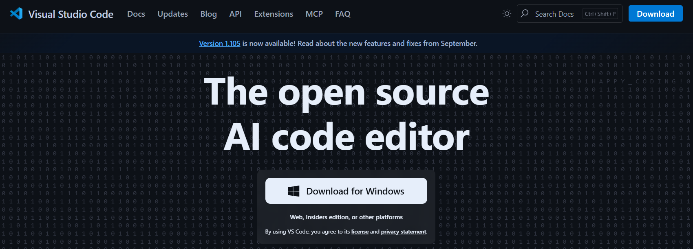

<!-- **💡 Sobre las imágenes**: Incluye capturas de pantalla para mostrar los diferentes pasos o resultados. Ejemplo: -->

**Proceso de instalación:**

- **Descarga:**

1. El archivo a instalar se debe mostrar como el siguiente:

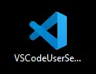

2. Al ejecutar el archivo aparecerá el siguiente apartado donde tendremos que aceptar la licencia y clickear en "Siguiente", como se muestra a continuacion:

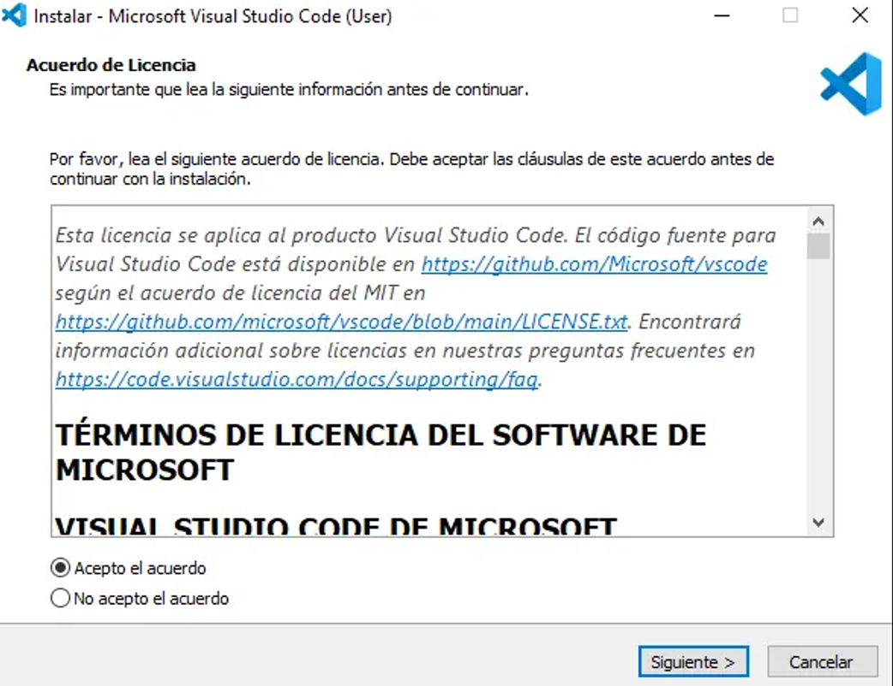

3. En la siguiente ventana, se tendrá que seleccionar la ruta de la instalación, se recomienda usar la ruta predeterminada para evitar errores de funcionamiento.

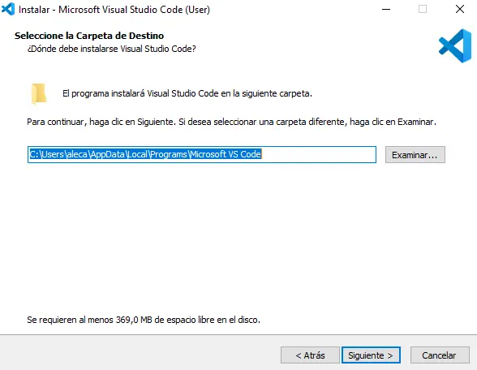

4. Posteriormente en la siguiente ventana, habrá que seleccionar la carpeta de menú de inicio, se recomienda usar la carpeta predeterminada y dar clic en "Siguiente".

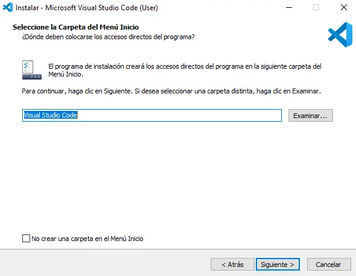

5. En la siguiente ventana, seleccionaremos las tareas adicionales por defecto, pudiendo tambien seleccionar el apartado de "Crear un acceso directo en el escritorio" para facilitar el acceso y clickearemos "Siguiente".

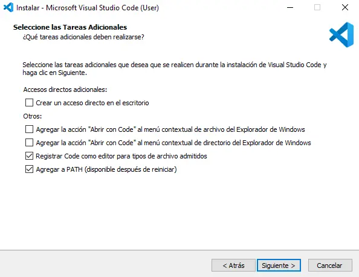

6. En la siguiente ventana se mostrarán las configuraciones guardadas, por ello solo haremos click en "Instalar".

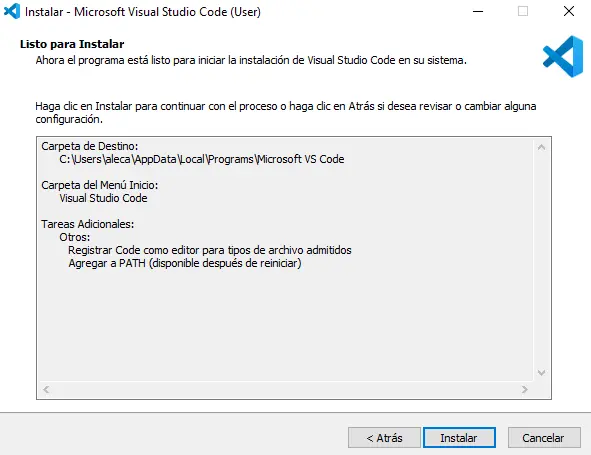

7. Ahora se mostrará la barra del proceso de instalación y deberá esperar hasta que la barra llegue hasta el final.

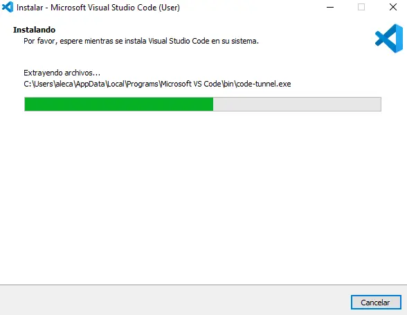

8. La siguiente ventana nos confirmará que la instalación ha concluido, podemos ejecutar Visual Studio Code dejando la casilla marcada o cerramos la ventana y lo abrimos desde su acceso directo.

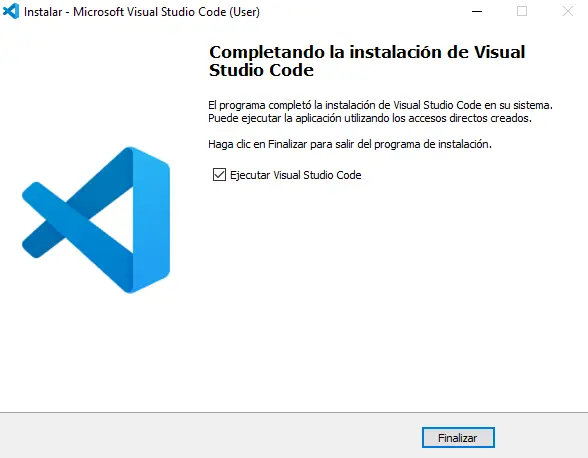

De este modo Visual Studio Code queda instalado correctamente y listo para usarse como entorno de desarrollo.

- **Opciones del instalador:** Durante el proceso de instalación hay diversas opciones que mejoran como VS Code se integrará en el sistema. Por ejemplo en la ventana de "Seleccionar las Tareas Adicionales":

  -Crear un acceso directo en el escritorio: Facilita el acceso rápido al usuario.

  -Agregar la accion "Abrir con Code" al menu contextual de archivo del Explorador de Windows: Permite abrir carpetas o archivos desde el Explorador de archivos.

  -Registrar Code como editor para tipos de archivo admitidos: Permite abrir archivos como .cs, .js, .py, entre otros, usando VS automáticamente.

  -Agregar a PATH: Permite ejecutar VS desde la terminal de Windows.

- **Verificación:** Para verificar que Visual Studio Code funcione adecuadamente puedes seguir estos pasos:

1. Abrir Visual Studio Code desde el acceso directo o el menú de inicio y confirmar que la aplicacion inicia sin errores.
2. Desde la terminal, escribir el comando: code --version

   El comando deberia devolver un número de versión, significando que VS Code está agregado correctamente al PATH del sistema.

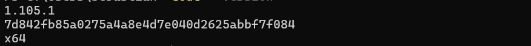

De este modo confirmas que VS Code esta instalado y configurado correctamente.

<!--*Es posible documentar múltiples métodos.*-->

### Uso Básico de VS Code

**Navegación y funcionalidades básicas:**

- Navegación por la interfaz:
  Al abrir Visual Studio Code, se muestra la pantalla principal con la barra lateral izquierda y el área de trabajo en el centro.  
  Desde la barra lateral puedes acceder al **Explorador de archivos**, **Búsqueda**, **Control de versiones**, **Depuración** y **Extensiones**.

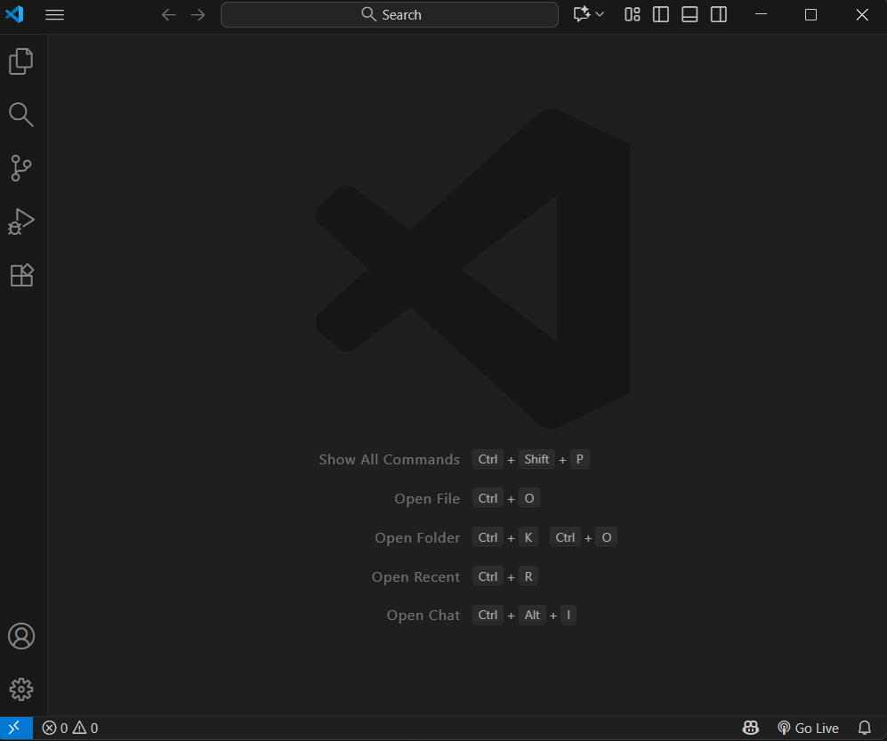

Puedes ocultar o mostrar la barra lateral con el atajo "Ctrl + B"

- Edición de código: Visual Studio Code permite editar fácilmente archivos de código en múltiples lenguajes de programación.  
  Ofrece **resaltado de sintaxis**, **autocompletado inteligente (IntelliSense)** y más con el fin de mejorar la productividad.

  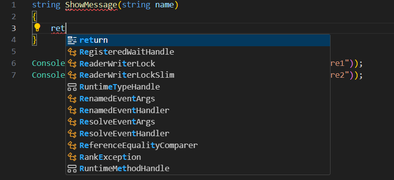

- Uso de la paleta de comandos: La **paleta de comandos** permite cambiar el tema, abrir configuraciones, ejecutar tareas o instalar extensiones.

  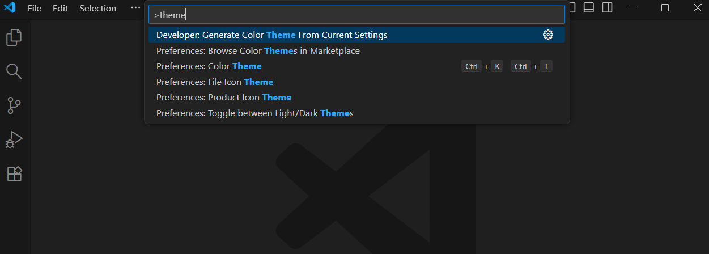

Puedes abrirla con el atajo `Ctrl + Shift + P` y si no recuerdas dónde está una opción en el menú, búscala directamente desde la paleta de comandos.

- Gestión de archivos y carpetas: Visual Studio Code permite trabajar fácilmente con proyectos organizados por carpetas.  
  Puedes abrir una carpeta desde el menú **Archivo → Abrir carpeta…** o arrastrándola directamente al editor.

  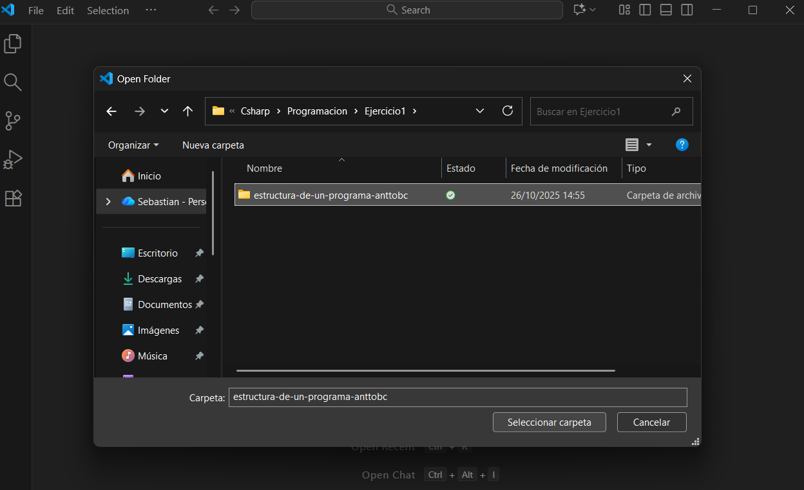

  Una vez abierta, los archivos y subcarpetas aparecerán en el **Explorador** (barra lateral izquierda).

  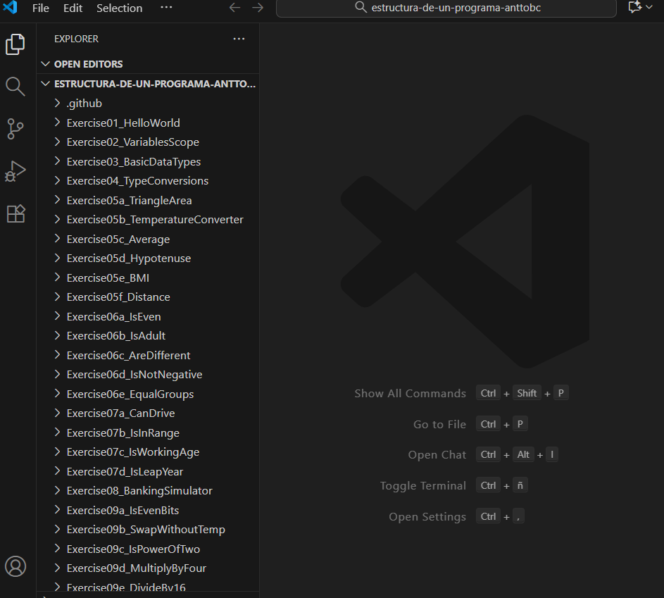

  Desde allí puedes crear nuevos archivos (`Nuevo archivo`) o carpetas (`Nueva carpeta`) usando los iconos de la parte superior.

  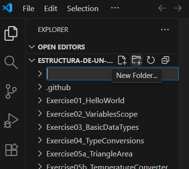

Usa los atajos `Ctrl + N` para crear un nuevo archivo y `Ctrl + S` para guardar rápidamente.

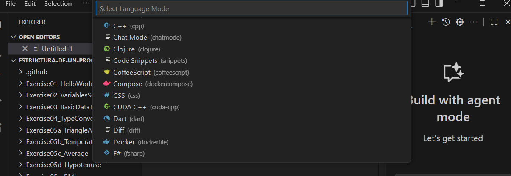

### Personalización del Entorno

**Configuraciones aplicadas:** <!--[Describir las personalizaciones que se realizaron] *Ejemplos de configuraciones útiles (elegir las que se consideren relevantes):*-->
Para optimizar el entorno de trabajo y hacerlo más cómodo visualmente, se aplicaron las siguientes personalizaciones dentro de VS Code:

1. **Tema de color:**  
   Se instaló el tema **One Dark Pro**, que mejora la legibilidad del código con un contraste equilibrado.

   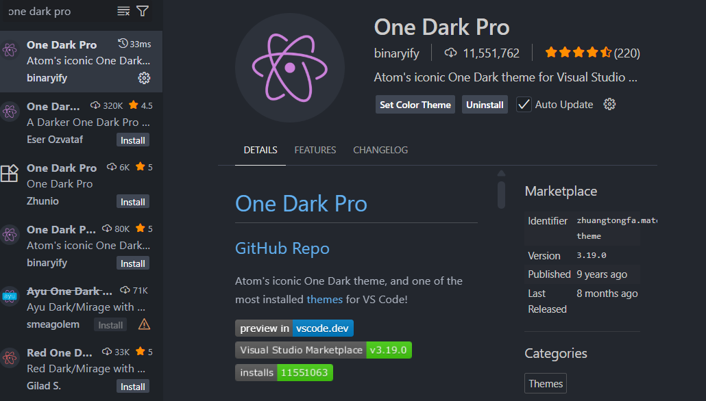

2. **Terminal integrada:**  
   Se estableció **PowerShell** como terminal predeterminada.

   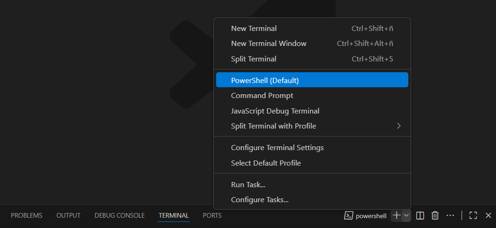

   Para verificar que PowerShell esté funcionando correctamente, se ejecutó el siguiente comando:

   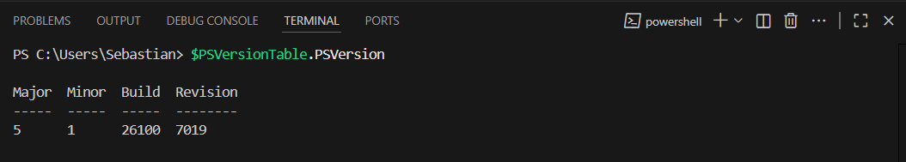

   El resultado confirma la version de PowerShell instalada en el sistema.

**Temas e iconos:** Para mejorar el entorno visual se instalaron los siguientes temas desde las extensiones.

- One Dark Pro: Ofrece un tema oscuro y buena legibilidad.

- Material Icon Theme: Permite la identificacion de archivos por medio de iconos representativos.

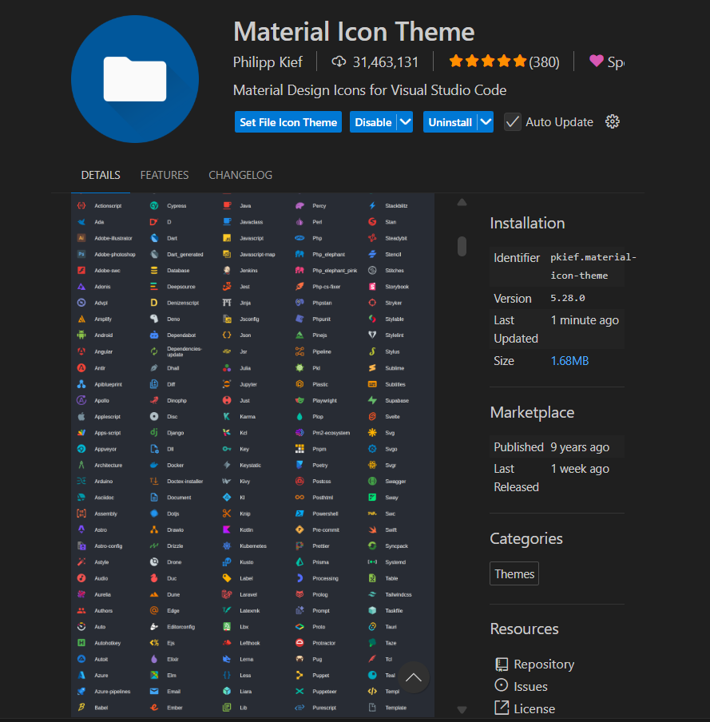

**Configuración de fuentes:**
Se instaló la fuente **Fira Code**, que tambien incluye ligaduras tipográficas (combinaciones visuales de símbolos), lo que mejora la legibilidad del código.

- Pasos para instalar Fira Code en Windows:

1. Entrar a su sitio oficial: https://github.com/tonsky/FiraCode

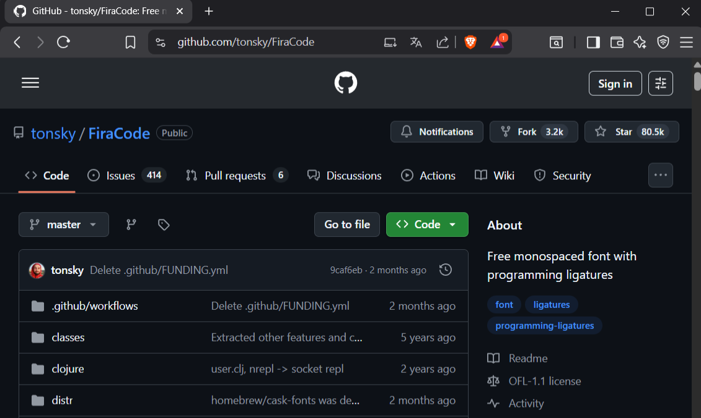

2. Descargar el archivo zip con las fuentes.

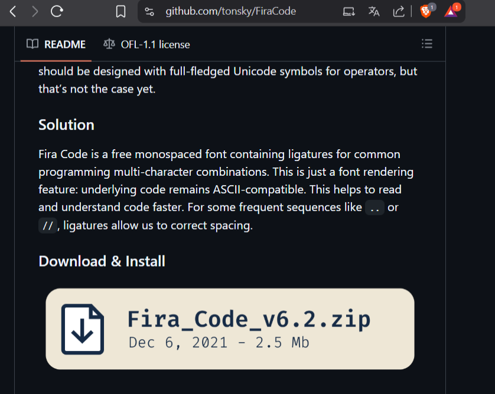

3. Descomprime el zip, luego entra en la carpeta ttf, posteriormente haz click en todos los archivos tff, después "Instalar".

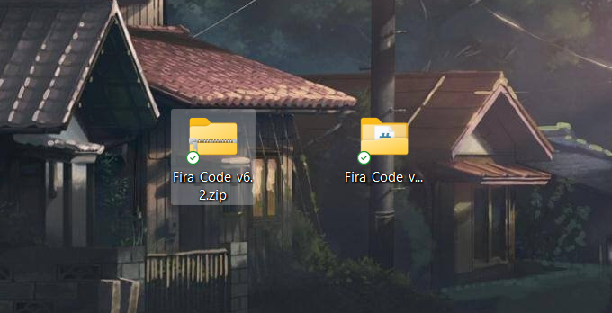

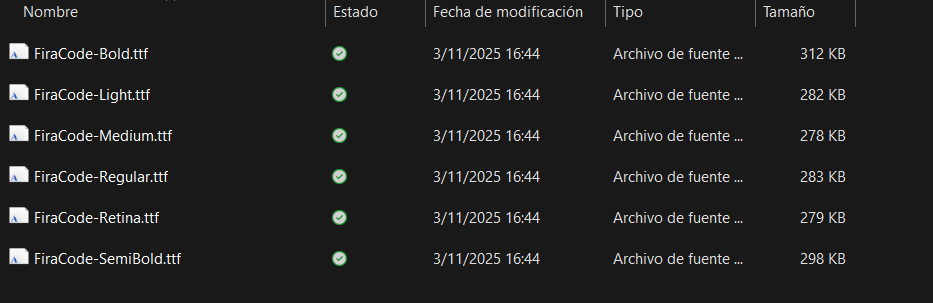

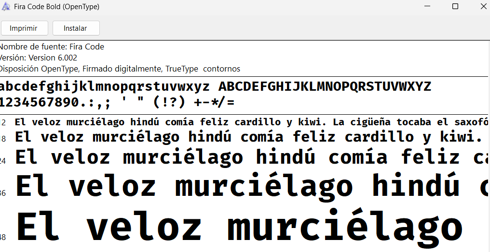

4. Entra a VS Code, ve a Archivos> Preferencias>Configuracion.

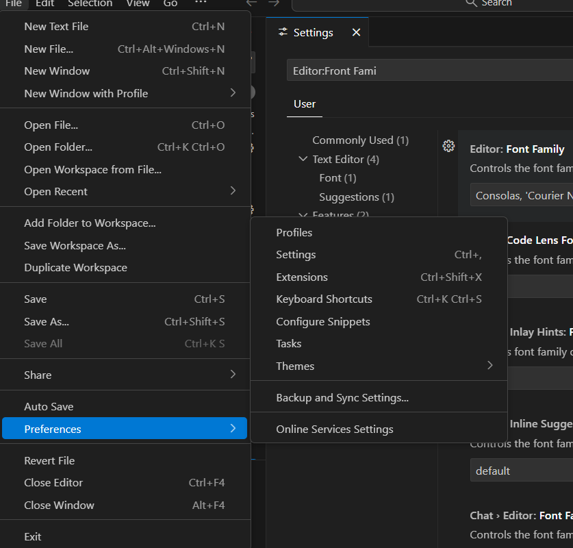

5. En la barra de Busqueda de Configuraciones, escribe "Editor: Font Family"

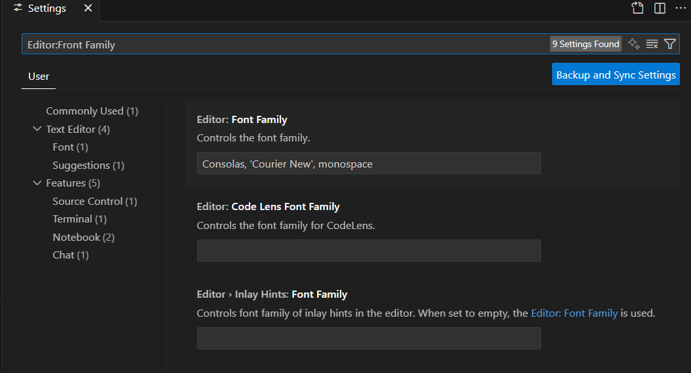

6. En el apartado de "Editor: Font Family" escribe: 'Fira Code Light', Consolas, 'Courier New', monospace

Aunque el nombre 'Fira Code Light' puede variar dependiendo del nombre de la fuente instalada, para verificar el nombre ingrese en Configuracion> Personalizacion> Fuentes> Busque la fuente, en este caso Fira code y seleccione la fuente adecuada.

Aqui se puede ver los distintos tipos de fuente:

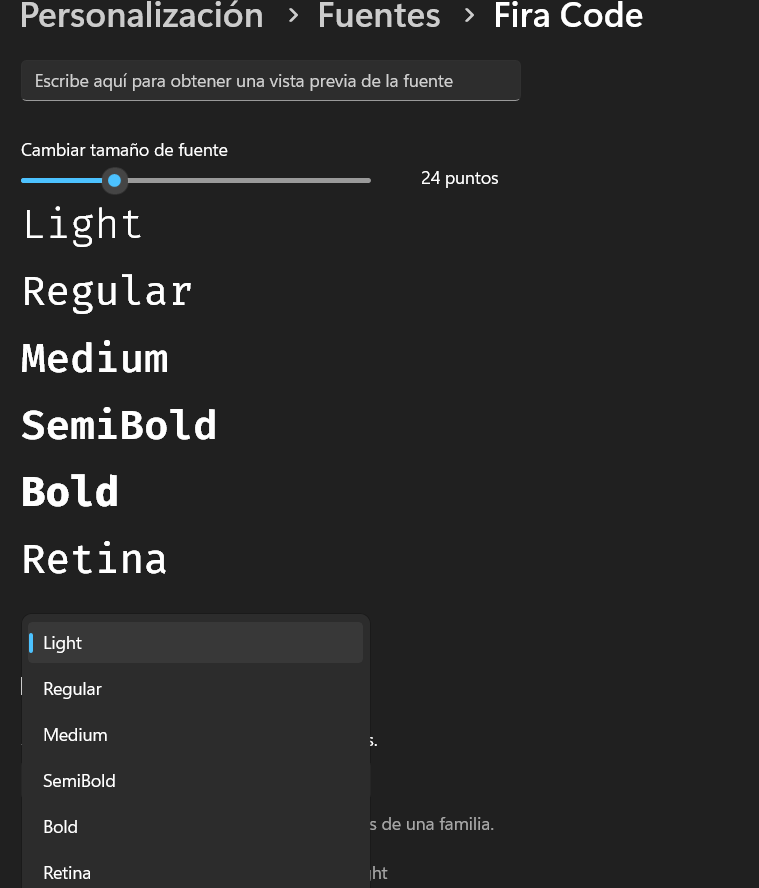

A continuacion se muestra el nombre completo:

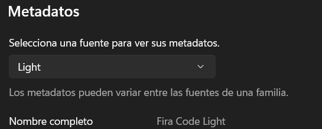

Se debe reemplazar 'Fire Code Light' por el nombre completo de su fuente.

Para activar las ligaduras debe buscar en Configuracion:

Editor: Font Ligatures

Posteriormente entrar en el apartado: Edit in settings.json

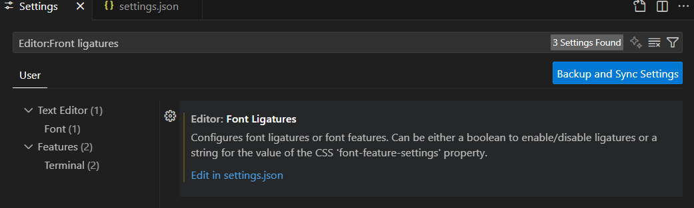

En este archivo debe reemplazar el valor 'false' por 'true' en el apartado:

"editor.frotnLigatures": False

De este modo:

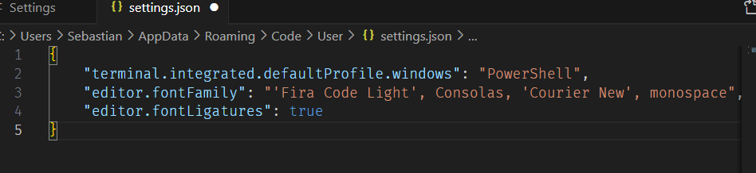

Entonces ya tenemos las ligaduras activas y la fuente activa:

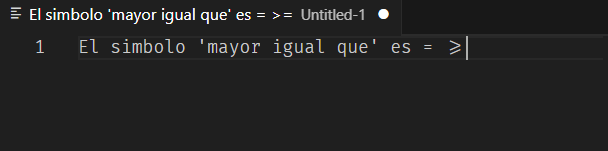

Fuente Fira Code:

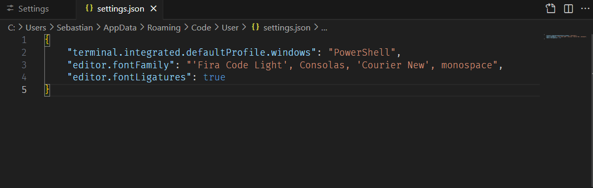

Fuente Comic Sans MS (Ejemplo comparativo):

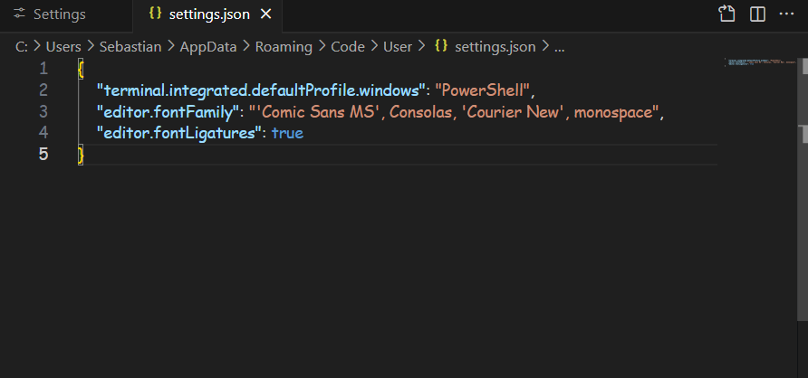

**Atajos de teclado útiles:** Los atajos predeterminados más usados:

- `Ctrl + Shift + P` → Abrir paleta de comandos
- `Ctrl + S` → Guardar archivos
- `Alt + ↑ / ↓` → Mover líneas de código
- `Ctrl + K + Ctrl + O` → Abrir carpeta
- `Ctrl + O` → Abrir archivo
- `Ctrl + D` → Seleccionar todo lo que coincide con la palabra actual
- `Alt + Click` → Agrega cursores donde hagas click
- `Ctrl + Alt + ↓`/`Ctrl + Alt + ↓` → Agrega cursores en las lineas consecutivas

**Configuración del editor:** Algunas configuraciones utiles del editor son:

- Formateo automático al guardar: Esto significa que cada vez que se guarda un archivo ('Ctrl + S') VS Code ajusta automáticamente sangrías, espacios y estilo de código según las reglas del lenguaje o las extensiones instaladas. Para activarlo puedes ingresar en: VSCode >Archivo >Preferencias >Configuracion >Editor de Texto--En este apartado buscamos "Editar en settings.json" y agregamos el comando:

  "editor.formatOnSave": true

- Detección automática de indentación: VS Code detecta si el archivo usa tabs o espacios y los ajusta automáticamente mientras se escribe, evitando mezclar ambos tipos de indentación y haciendolo mas comodo.Su comando es:

  "editor.detectIndentation": true

- Word wrap para líneas largas: Permite que las líneas de código se ajusten al ancho de la ventana del editor, su comando es:

  "editor.wordWrap": "on"

- Línea actual resaltada: Resalta la línea donde el cursor está, mejorando la lecura y facilitando la ubicación del cursor.Su comando es:

  "editor.renderLineHighlight": "all"

- Guías de indentación: : Muestra líneas verticales para visualizar niveles de indentación, esto es muy util en lineas de código anidadas.

  "editor.renderIndentGuides": true

Al final, el archivo "settings.json" deberia quedar de este modo:

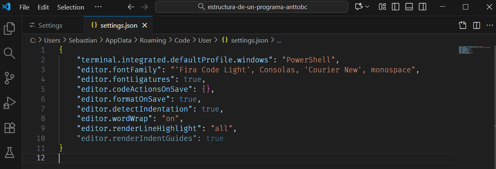

**Terminal integrada:**

- PowerShell como terminal predeterminado: Esto permite que VS Code abra PowerShell automaticamente cada vez que se abra la terminal integrada.

- Configuración de perfil personalizado: Se puede utilizar diferentes terminales (cmd, Git Bash, WSL, PowerShell Core) y sus opciones especificas, permitiendo usarlas segun el proyecto o necesidad. Un ejemplo de configuracion en el archivo "settings.json":

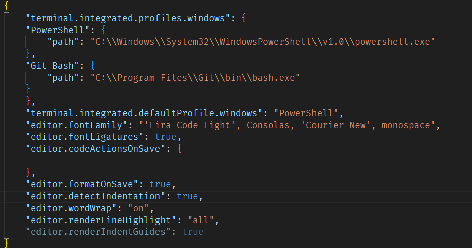

En este ejemplo aparece el perfil "Git Bash". Este perfil usa la terminal Git Bash, que permite usar comandos tipo Linux en Windows, lo que puede facilitar a los desarrolladores mas acostumbrados a ese entorno.
Tambien se puede abrir en paralelo diferentes terminales usando el boton "+" en la pestaña de la terminal. Aunque solo funcionará si tienes Git instalado en el sistema.

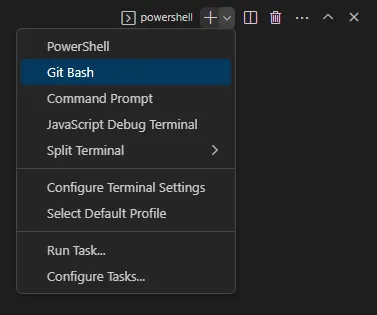

> **Personaliza según tus necesidades**: Estas son sugerencias basadas en prácticas comunes. Experimenta y documenta las configuraciones que encuentres más útiles para tu flujo de trabajo.> 💼 **Manual de Incorporación**: Esta guía establece los estándares del equipo para configurar entornos de desarrollo en C#. Cualquier nuevo desarrollador debe poder seguir estas instrucciones para configurar su entorno de trabajo de manera consistente con el resto del equipo.

### SDK .NET

**Proceso de instalación:**
**Descarga e instalación:** A continuacion se muestran los pasos para instalar .NET,necesario para desarrollar aplicaciones en VS Code:

1. Ve a la pagina oficial de descargas de .NET.

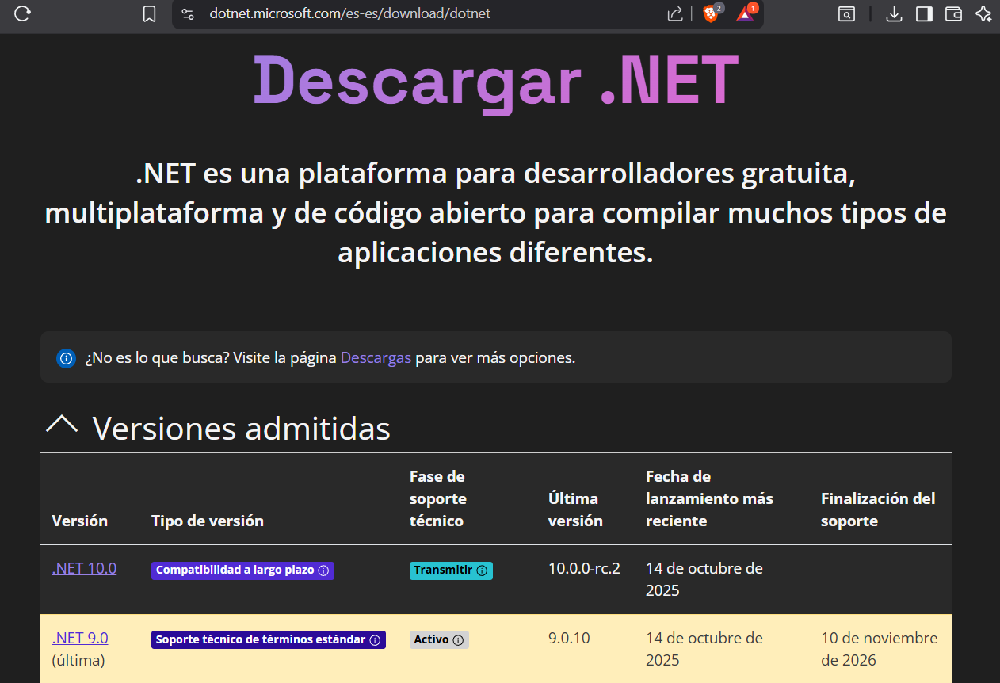

2. Selecciona la version que desees instalar (Por ejemplo .NET 10.0, .NET 9.0)
3. En la seccion de 'Compilación de aplicaciones: SDK' haz click en el instalador que corresponda a tu sistema operativo.

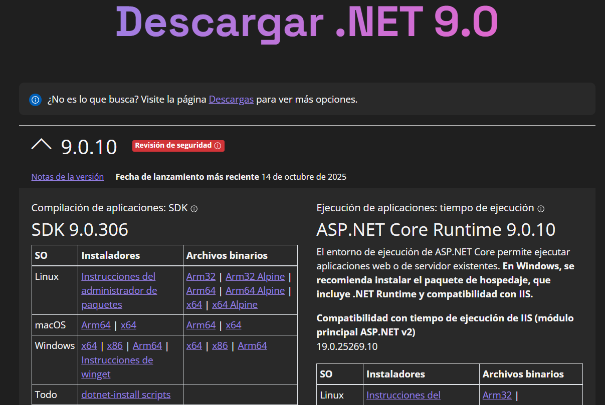

4. Ejecuta el instalador, acepta los terminos de licencia y utiliza la ruta predeterminada para evitar que funcione incorrectamente.

5. Finaliza la instalacion siguiendo las indicaciones o opciones predeterminadas.Es importante no confundir con la seccion "Ejecucion de aplicaciones:tiempo de ejecucion" que solo sirve para ejecutar aplicaciones ya hechas y no incluye las herramientas necesarias para su desarrollo.

**Verificación:** Para confirmar que el SDK se instaló correctamente puedes abrir PowerShell o la terminal integrada de VS Code y ejecutar el comando:

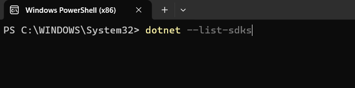

Deberia aparecer una lista de las versiones instaladas, por ejemplo:

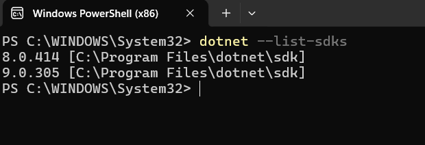

**Proceso de instalación:**
**Descarga e instalación:** A continuacion se muestran los pasos para instalar .NET,necesario para desarrollar aplicaciones en VS Code:

1. Ve a la pagina oficial de descargas de .NET.

2. Selecciona la version que desees instalar (Por ejemplo .NET 10.0, .NET 9.0)
3. En la seccion de 'Compilación de aplicaciones: SDK' haz click en el instalador que corresponda a tu sistema operativo.

4. Ejecuta el instalador, acepta los terminos de licencia y utiliza la ruta predeterminada para evitar que funcione incorrectamente.

5. Finaliza la instalacion siguiendo las indicaciones o opciones predeterminadas.Es importante no confundir con la seccion "Ejecucion de aplicaciones:tiempo de ejecucion" que solo sirve para ejecutar aplicaciones ya hechas y no incluye las herramientas necesarias para su desarrollo.

**Verificación:** Para confirmar que el SDK se instaló correctamente puedes abrir PowerShell o la terminal integrada de VS Code y ejecutar el comando:

Deberia aparecer una lista de las versiones instaladas, por ejemplo:

En este caso, lo que muestra indica que los SDKs de .NET 8 y .NET 9 están correctamente instalados en el sistema. Aunque las versiones pueden variar, la primera columna corresponde a la versión del SDK y la segunda a la ruta de instalación.De este modo ya puedes crear, compilar y ejecutar proyectos .NET en VS Code sin problemas.

### Configuración para C#

**Extensiones esenciales:** Para desarrollar en C# en VS Code se recomienda instalar las siguientes extensiones desde el Marketplace:

- **Soporte oficial para C#**: La extensión oficial de Microsoft para C# en VS Code es "C#". Proporciona IntelliSense, Debugging y compilación.

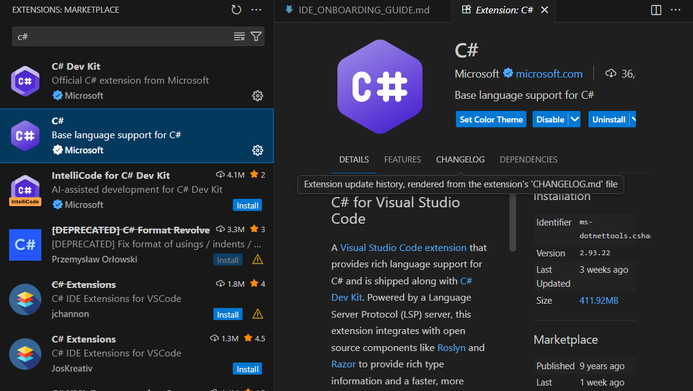

C# Dev Kit (Microsoft): Se recomienda instalar esta extensión ya que es más completa que la extensión básica "C#".Incluye todo lo necesario para trabajar con proyectos .NET y añade herramientas adicionales.

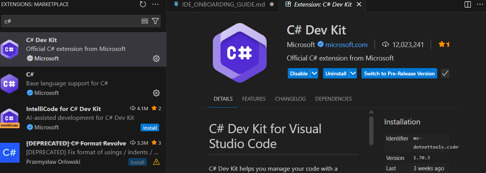

**Configuraciones específicas para C#:**
A continuacion se muestran configuraciones aplicadas para mejorar la experiencia de desarrollo en C#:

- **IntelliSense**: Autocompletado de codigo, sugerencias de metodos, propiedades y ayudas mientras se escribe. Activado automáticamente con C# Dev Kit.
- **Debugging (depuración)**: Permite crear breakpoints, inspeccionar variables y ejecutar paso a paso.
- **Compilación y ejecución**: Reconoce automáticamente el .NET SDK instalado y permite ejecutar comandos como `dotnet build` y `dotnet run` desde la terminal integrada.
- **Formateo automático al guardar**: Ajusta sangrías, espacios y estilo de código según las reglas del lenguaje. Configurable en 'settings.json':

  "editor.formatOnSave": true

- **Navegación rápida entre métodos y clases**: Permite ir al código de un metodo o clase con Ctrl + Click o usando la paleta de comandos.
- **Refactorización y sugerencias de código**: Permite renombrar variables, extraer métodos, mover clases y otras mejoras de manera automática.
- **Soporte para proyectos grandes**: Mejora el rendimiento y la organización cuando trabajas con soluciones complejas o múltiples proyectos en el mismo workspace.

**Debugging básico:** El proceso de debugging nos permite seguir la ejecución paso a paso del programa, revisar los valores de las variables en tiempo real y detectar posibles errores, a continuacion se muestra cómo se aplicó en el proyecto de ejemplo. El codigo utlizado fue el siguiente:

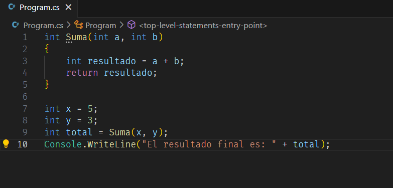

- Configuración de puntos de interrupción (breakpoints): Se coloco un breakpoint (punto de interrupcion) en la linea 9. Esto provoca que el programa se detenga justo antes de ejecutar la linea donde se encuentra el punto de breakpoint, es decir ejecuta hasta la linea 8.

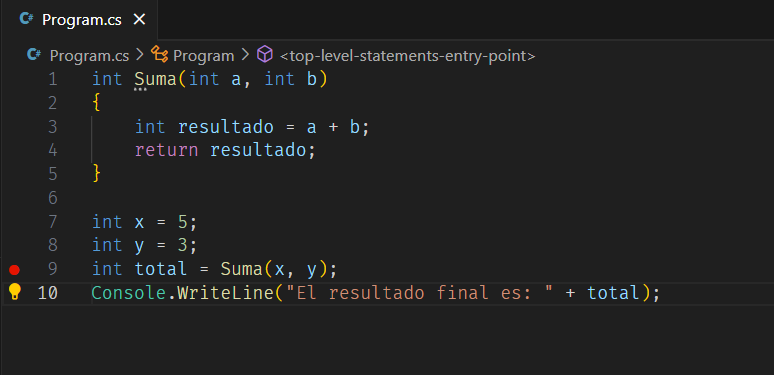

- Ejecutar y depurar: Al presionar F5 o el icono ▶ (Reproducir) el programa se detiene en el punto marcado, en ese momento se pueden observar las variables locales o que pertenecen a la funcion en el panel de Run and Debug:

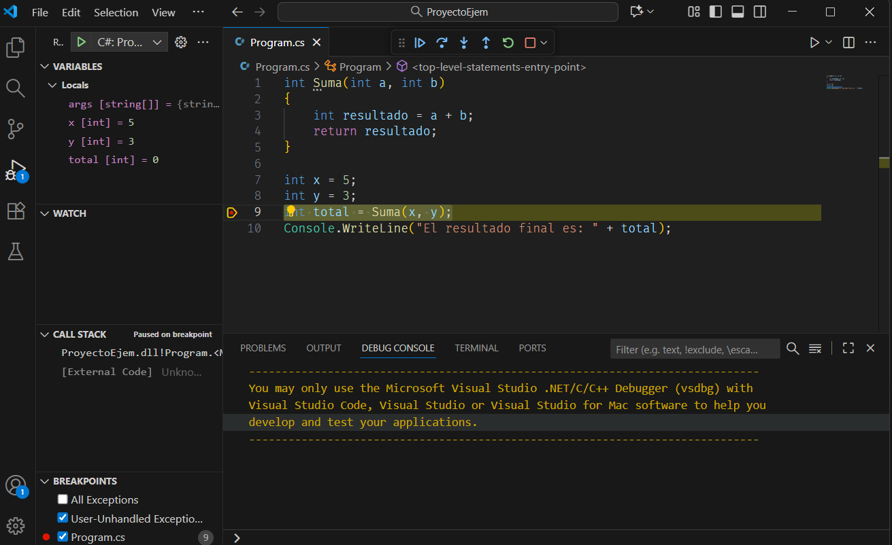

- Inspección de variables: En este caso, el programa inicia declarando las variables x y y con los valores 5 y 3. Cuando se llama a la función Suma(x, y), el panel de Run and Debug muestra cómo esos valores se asignan a los parámetros a y b dentro de la función, hasta ese momento la variable resultado aún no tiene valor porque la línea que realiza la suma (int resultado = a + b;) todavía no se ha ejecutado, si se avanzase una linea más, podria observarse cómo resultado pasa a valer 8 y posteriormente este valor se devuelve y se almacena en la variable total, la cual se muestra por consola.

> **Enfoque práctico**: Concentra tu documentación en las funcionalidades básicas que usarás día a día.

### Flujo de Trabajo con C#

**Creación de proyectos:** A continuacion se detalla el proceso paso a paso:

1.  Verificar la instalación del SDK de .NET:
    El primer paso es abrir Visual Studio Code y comprobar que el SDK de .NET funciona correctamente.
    Esto se puede hacer ejecutando en la terminal el siguiente comando: dotnet --version

        Si aparece un numero de version significa que el SDK esta instalado.

2.  Crear un nuevo proyecto: En la terminal integrada de VS Code podemos ejecutar el siguiente comando para crear un nuevo proyecto.

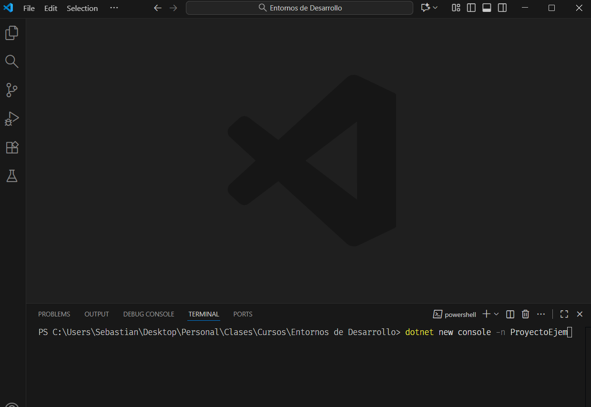

**dotnet new console**: indica que el tipo de proyecto será una aplicación de consola.

**-n ProyectoEjem**: indica el nombre del proyecto.

3. Despues de crear el proyecto debemos acceder a la carpeta del proyecto, para ello usamos el comando "cd" y el nombre de la carpeta.

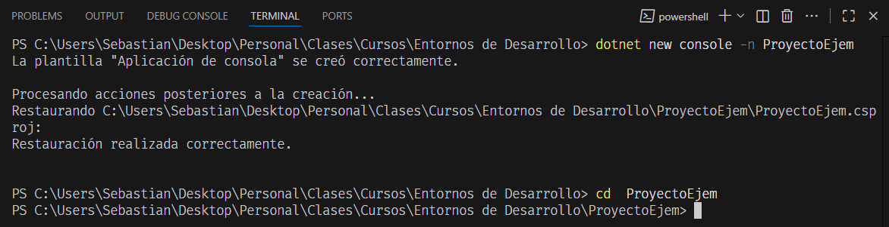

De este modo el proyecto quedaria creado y listo para modificarse.

**Estructura de proyecto:**
Luego de haber creado el proyecto, dentro de la carpeta principal se generan automáticamente varios archivos y carpetas.
Los mas importantes son:

**Pogram.cs**: Contiene el codigo principal del programa

**ProyectoEjem.csproj**: Archivo de configuracion del proyecto, define el tipo de proyecto, propiedades y dependencias.

**bin/ y obj/**: carpetas generadas automáticamente al compilar el proyecto, almacenan archivos intermedios y el ejecutable final.

A continuación se muestra el código desarrollado en el archivo Program.cs:

Comentarios de las decisiones tomadas:
Se utilizó la función llamada Suma para mostrar cómo definir y llamar métodos en C#. La función recibe dos parámetros (a y b) y realiza la operación de suma (a + b) y devuelve el resultado como un valor de tipo int. Se decidio que Suma devuelva un valor en lugar de imprimirlo directamente, ya que esto la hace más práctica y reutilizable. Ademas se utilizaron variables (x, y, total) para facilitar la depuración, ya que de esta forma se puede seguir el flujo del programa y observar como cambian los valores paso a paso.

**Compilación y ejecución:**:
Posteriormente de haber creado el proyecto y escrito el código en el archivo Program.cs, el siguiente paso es compilarlo y ejecutarlo, con el fin de verificar que el codigo no tenga errores y observar su funcionamiento.

1. Compilacion: La compilación permite convertir el código fuente de C# en un archivo ejecutable.En la terminal integrada de VS Code, dentro de la carpeta del proyecto se utiliza el siguiente comando: dotnet build

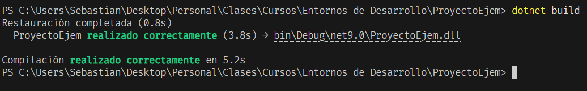

2. Ejecucion: Si la compilación fue correcta el programa se puede ejecutar con el siguiente comando:

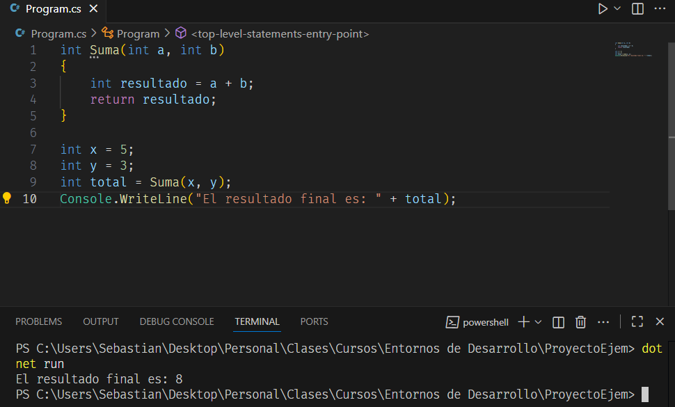

Esto confirma que la función Suma() se ejecutó correctamente y que la lógica del programa funciona como se esperaba.

**Debugging:**
El proceso de depuración permite ejecutar el programa paso a paso, con el fin de analizar su comportamiento de forma precisa. En este proyecto se colocó un breakpoint (punto de interrupción) dentro de la función Suma, permitiendo observar como los valores de x y y se asignan a los parámetros a y b.
Durante la ejecución paso a paso (con F10 o F11), se puede ver cómo la variable resultado cambia su valor tras ejecutarse la instrucción resultado = a + b;, y cómo ese valor se devuelve y se almacena en total.

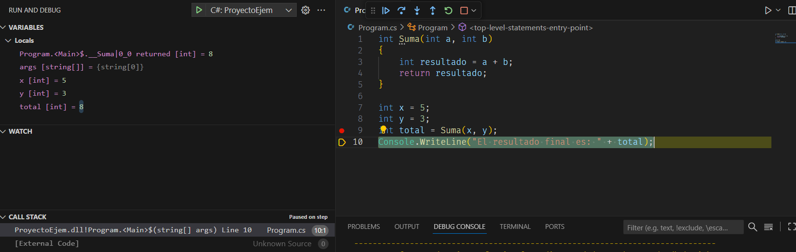

## Visual Studio - IDE Alternativo

### Instalación

**Proceso de instalación:**

- **Descarga:**
  Se accede a la pagina oficial de Visual Studio (https://visualstudio.microsoft.com/es/downloads/ o https://visualstudio.microsoft.com/es/), posteriormente se selecciona la versión Community, recomendada por ser gratuita y contener todas las funciones necesarias para desarrollo educativo o personal, aunque tambien existen versiones como "Professional" y "Enterprise", orientadas a entornos empresariales. "Professional" incluye herramientas adicionales para colaboración y gestión de equipos y "Enterprise" añade funciones avanzadas de rendimiento, pruebas y análisis para grandes proyectos corporativos.En el caso de usar Visual Studio Community se seguirian estos pasos:

1. Entramos al siguiente enlace https://visualstudio.microsoft.com/es/vs/community/ para descargar Visual Studio Community y le damos al boton de descargar.

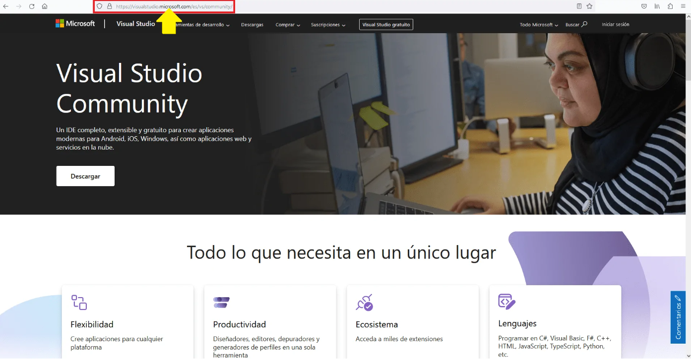

2. Nos descargara el instalador, una vez finalizada la descarga se debe hacer clic en ella y darle a "Continuar".

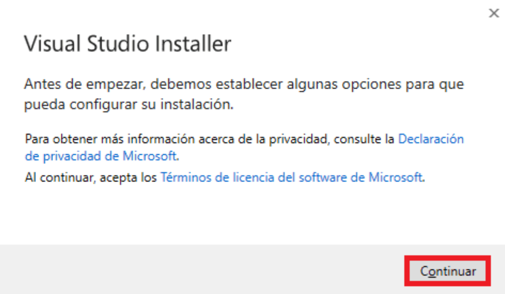

3. Una vez finalizada la descarga ejecutamos el instalador y seleccionamos la opción “Continuar”.

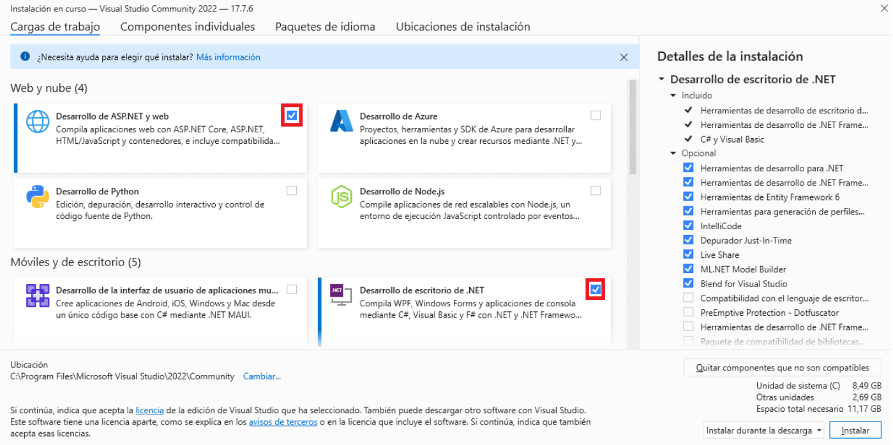

4. Visual Studio comenzara a instalarse,al culminar la barra de instalacion nos avisara que esta instalado

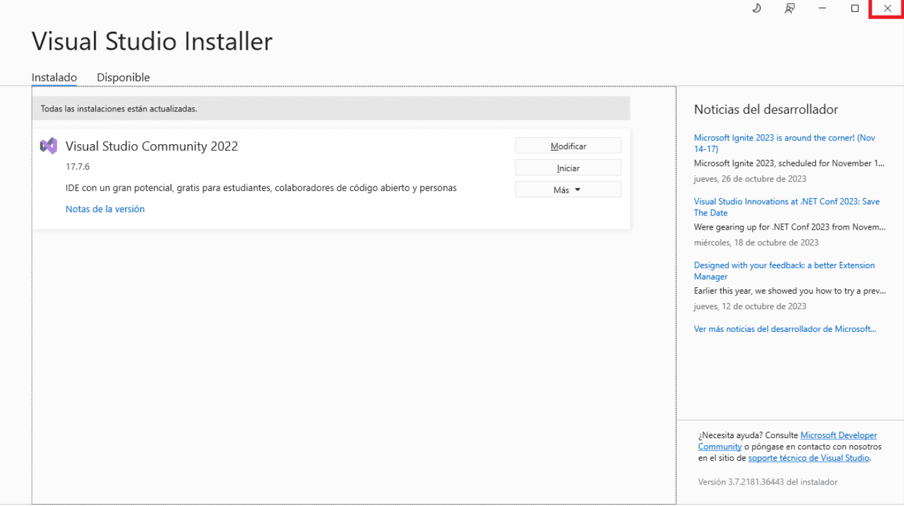

5. Finalmente, VS nos ofrecerá opciones como sincronizar la configuración mediante los servicios de Azure y elegir un entorno de desarrollo predeterminado (por ejemplo, C#, Visual Basic, o C++).
   Al terminar la configuración Visual Studio se abrirá por primera vez.

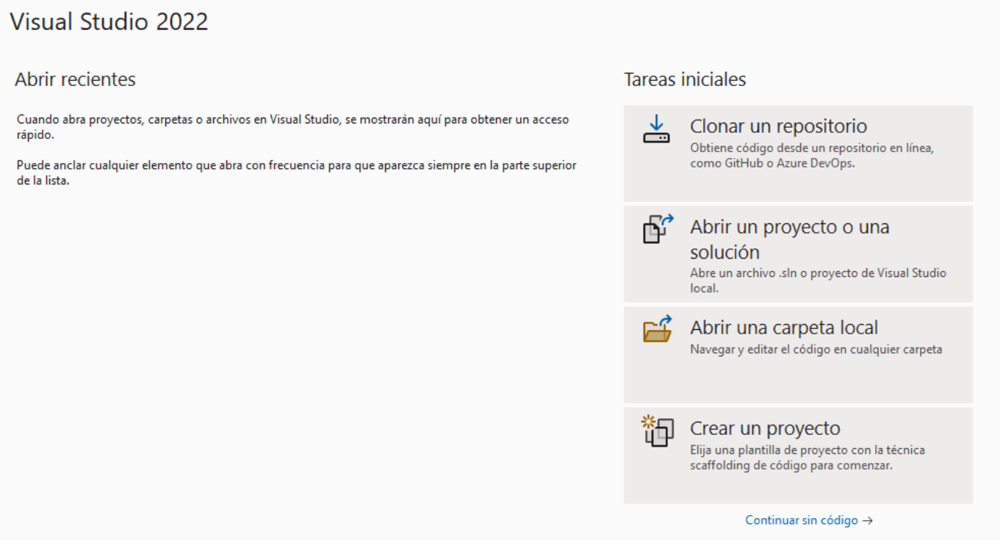

- **Componentes necesarios:** Durante el proceso de instalación Visual Studio permite elegir diferentes cargas de trabajo (workloads), estos son conjuntos de herramientas y librerías específicas según el tipo de desarrollo que se desee realizar, en este caso para C#, para ello se recomienda seleccionar los siguientes componentes:

  Desarrollo de escritorio con .NET: Permite crear aplicaciones de consola, formularios y aplicaciones WPF, tambien incluye el compilador de C#, el SDK de .NET, plantillas de proyectos y herramientas de depuración.

  Desarrollo multiplataforma con .NET (opcional): Permite crear aplicaciones que funcionan en diferentes sistemas operativos (Windows, Linux, macOS).

- **Verificación:** Hay varios metodos para verificar la correcta instalacion de VS, por ejemplo:

  Iniciar Visual Studio: Abrir el programa desde el menú de inicio o el acceso directo en el escritorio.

  Creando un proyecto de prueba: Seleccionar “Aplicación de consola (.NET)” y darle un nombre (por ejemplo Pruebavs).

  Ejecutar el proyecto: Pulsar el botón Iniciar (reproducir) o presionar F5. Si el entorno está correctamente configurado se abrirá una ventana de consola mostrando el mensaje “Hello World”.

  Tambien puedes verificarlo desde una linea de comandos, para ello debes abrir una terminal de Desarrolladores para VS (Esta se instala junto con el VS), escribe "dotnet --info", si la instalacion fue correcta mostrara informacion sobre el .NET SDK y las rutas de instalacion, confirmando que VS puede compilar proyectos .NET sin problemas.

### Desarrollo con C#

**Creación de proyecto:** Sigue los siguientes pasos:

1. Abre Visual Studio y selecciona “Crear un nuevo proyecto”.

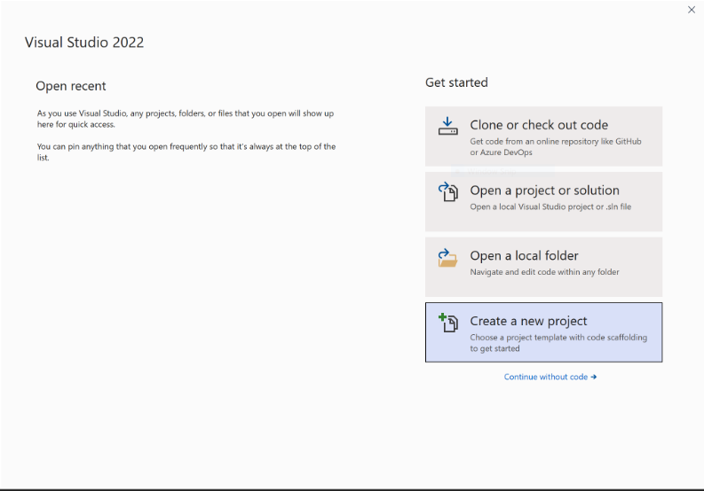

2. En la ventana de creación de proyectos, selecciona C#, Windows o “All platforms” como plataforma, y elige la plantilla “Aplicación de consola (.NET)”.

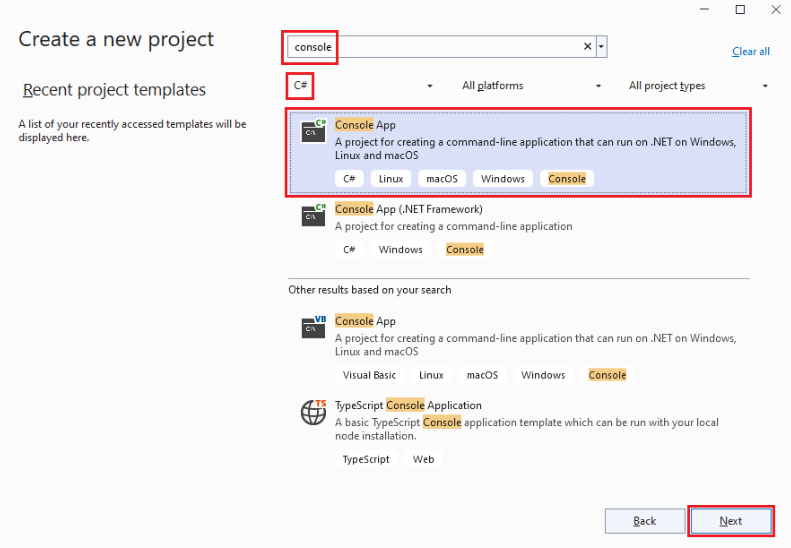

3. Configura tu nuevo proyecto, asignale un nombre, ruta o el nombre de una solucion y la versión del framework si es necesario y selecciona "Crear".

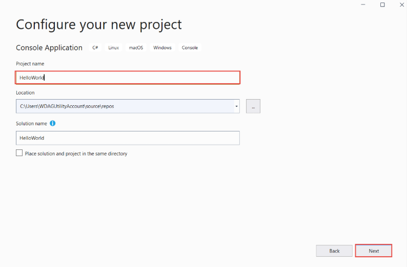

4. Visual Studio generará la plantilla básica del proyecto, con el archivo Program.cs o Program.vb y dentro de este podras escribir tu codigo C#.

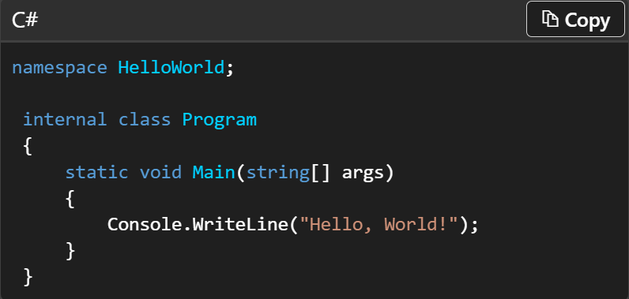

De este modo tienes el proyecto creado y listo para usarse.

**Flujo de trabajo básico:**

- Compilación y ejecución:
  Una vez creado el proyecto, el proceso de compilación convierte el código fuente escrito en C# en un ejecutable o archivo intermedio que puede ejecutarse en el entorno .NET.

Para empezar a compilar el programa, presiona el botón “Iniciar” en la barra de herramientas de VS (ícono de reproduccion en la barra superior) o presiona F5 o Ctrl+F5, el programa se ejecutara en el depurador. Visual Studio compilará automáticamente el proyecto y si no existen errores abrirá una ventana de consola mostrando el resultado del programa.
De haber errores se podra visualizar en el panel de salida, donde se muestra el proceso de compilación y ejecución con precision.

- Uso de Solution Explorer: Esta es una herramienta bastante util ,debido a que permite visualizar y administrar todos los archivos y recursos que forman parte del proyecto.
  Aqui se puede navegar entre los archivos del proyecto, agregar nuevos elementos como clases, formularios o carpetas, eliminar o renombrar archivos o configurar propiedades del proyecto.
  Para abrirlo presiona Ctrl+ Alt + L o se puede usar el menu: Ver > Explorador de soluciones.

- Debugging básico:
  Para iniciar la depuración se coloca un breakpoint en la línea de código donde desees que la ejecución se detenga.

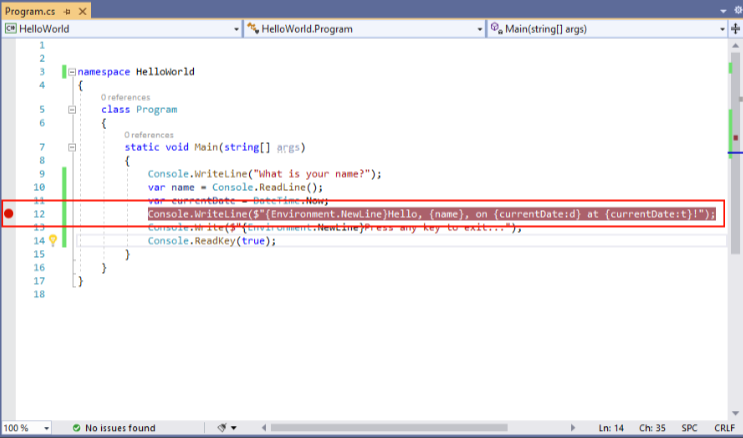

Luego, presiona F5 o el botón Iniciar depuración (icono de reproducción), tambien puedes elegir Depurar > Iniciar depuracion desde el menu.
Cuando el programa se detiene en el punto de interrupción, podrás observar el valor de las variables locales en el panel "Locals", así como examinar la pila de llamadas en la ventana "Call Stack".
Desde ahí puedes avanzar línea por línea con F10 (Step Over) o F11 (Step Into) para analizar el flujo del programa a detalle.

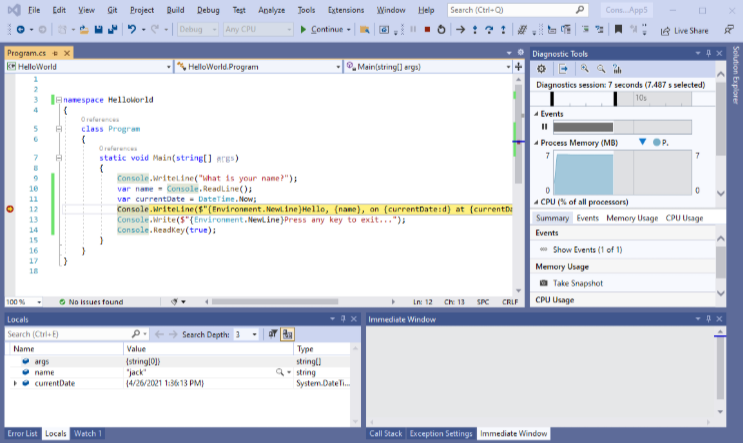

---

## Configuración de Lenguaje Adicional

**Lenguaje seleccionado:** Python
**Justificación:** Eligí Python por su sintaxis sencilla, amplia comunidad y su facilidad de aprendizaje, por ello se convierte en una gran opcion para principiantes, ademas de que es ampliamente utilizado en multiples campos como el desarrollo web, analisis de datos, IA, entre otros.

### Instalación del Entorno

**Runtime/SDK:**

- **Descarga e instalación:**

1. Accede a la pagina oficial de Python (https://www.python.org/downloads/) y se selecciona la version deseada, aunque se recomienda la mas reciente.

2. Durante la instalacion se recomienda marcar la opcion "Add Python to PATH", esto nos permite ejecutar Python desde cualquier terminal.

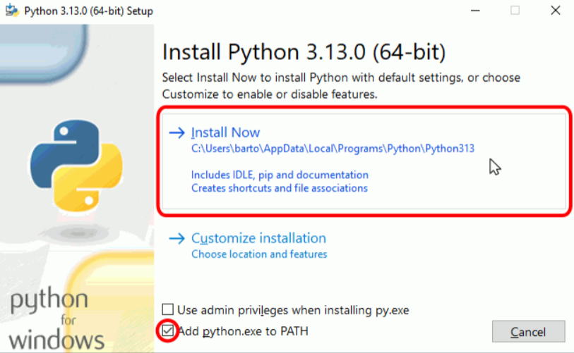

- **Verificación:** Una vez finalizada la instalacion, abre una terminal y ejecuta el comando: "python --version". Si la instalacion fue adecuada se mostrara la version instalada, por ejemplo "Python 3.13.0".

### Configuración en VS Code

**Extensiones por lenguaje:**

_Para Java:_

- **Paquete completo de Java**: Extension Pack for Java(Microsoft), incluye herramientas como Language Support for Java,Debugger for Java y Project Manager for Java, lo cual permite compilar, ejecutar y depurar programas Java dentro de VS Code.

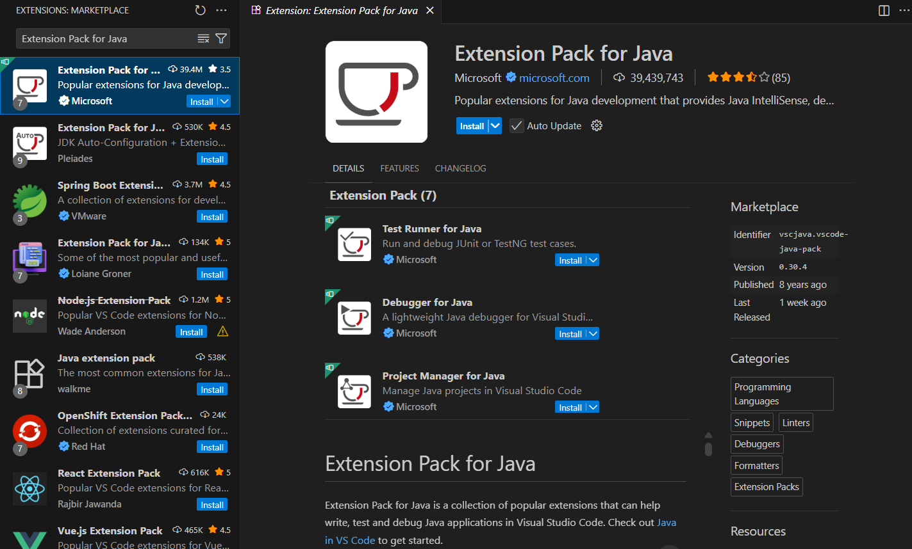

_Para Python:_

- **Soporte oficial de Python**: Python(Microsoft), extensión oficial que ofrece una compatibilidad total con el lenguaje, incluyendo autocompletado, ejecución de scripts, debugging y análisis de código.

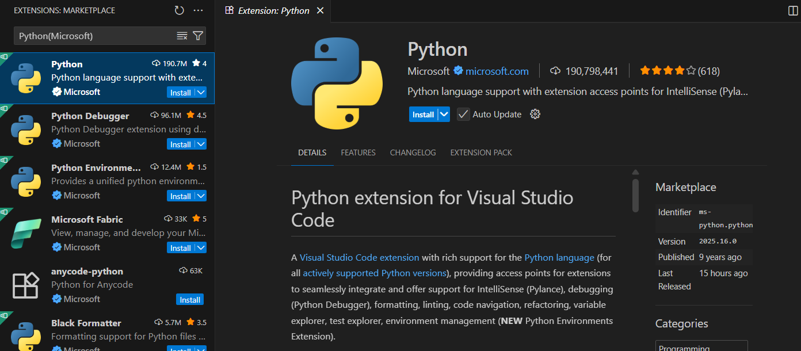

Pylance (Microsoft): Mejora la velocidad y precisión de IntelliSense, mejorando la productividad del desarrollador.

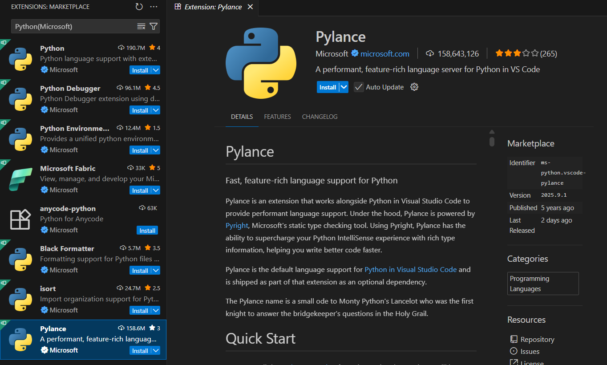

_Para otros lenguajes:_

- Busca la extensión oficial del lenguaje que proporcione soporte completo

**Configuraciones específicas aplicadas:**
Selección del intérprete de Python:

Desde la paleta de comandos (Ctrl + Shift + P) > “Python: Select Interpreter”.
Se eligió el intérprete de la versión instalada localmente para ejecutar y depurar el código.

Formateo automático del código:
Se activó la opción en el archivo settings.json:
"editor.formatOnSave": true
Esto garantiza un estilo de código limpio cada vez que se guarda el archivo.

Ejecución rápida:
Para ejecutar programas directamente se puede usar el botón “Run Python File” o el atajo Ctrl + F5.

### Proyecto de Ejemplo

**Código desarrollado:**
El lenguaje utilizado fue C#.

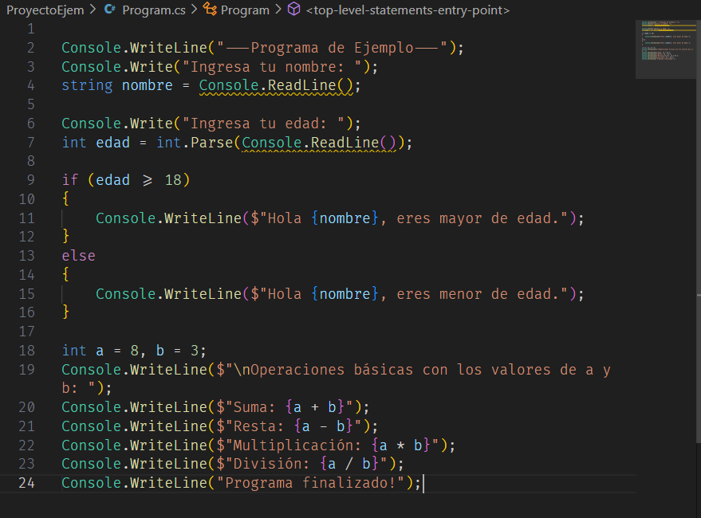

Comentarios Explicativos:

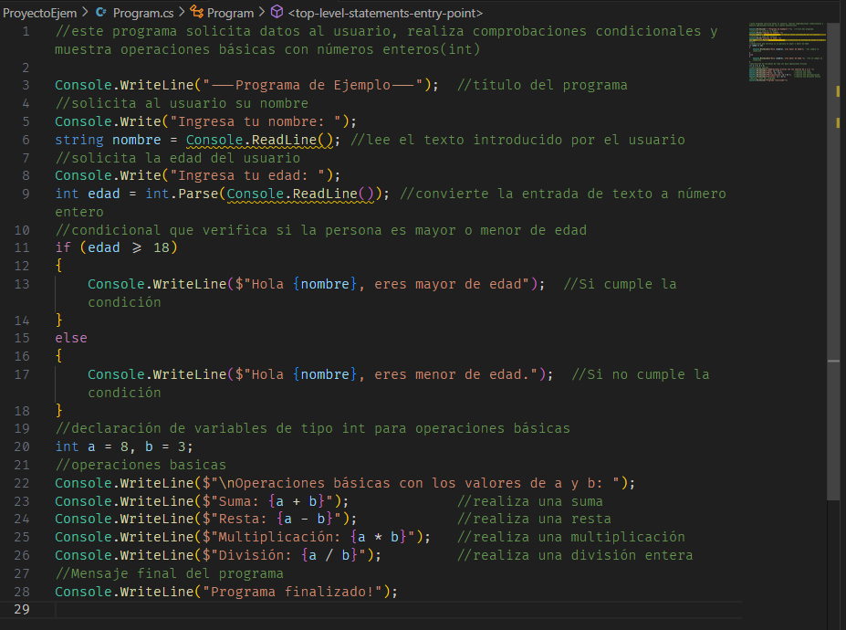

Se usa int.Parse() porque la entrada sera un numero, aunque se podria usar int.TryParse(), dado que sirve para convertir texto a un numero entero, pero no genera errores si el texto no es un numero valido, aunque se tendria que cambiar la condicion de if ya que devolveria "false" si el valor de la entrada es invalido.

**Proceso de ejecución:** Para ejecutar el programa se utiliza la terminal integrada de VS Code, dentro de la carpeta del proyecto, se ejecuta el comando: "dotnet run"

Esto compila el código y corre el programa en la consola, permitiendo ingresar los datos solicitados por el usuario (nombre y edad) y mostrar los resultados de las operaciones.

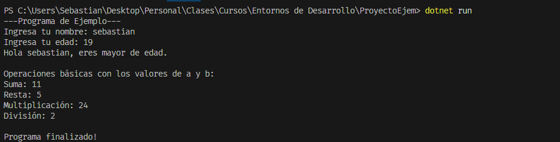

## Configuraciones Recomendadas

**Configuraciones generales:** Las configuraciones generales recomendadas para cualquier desarrollador son:

Configurar el color del tema: Se recomienda usar un tema que reduzca la fatiga visual y permita diferenciar claramente los elementos del código. siendo ademas util para sesiones largas y para la deteccion de errores, algunos ejemplos: One Dark Pro, Material Theme

Uso de Fuentes y tamaños apropiados: Usar fuentes monoespaciadas como Fira Code o JetBrains Mono y con ligaduras activas, esto mejora la legibilidad del codigo y facilita la identificacion de operadores y simbolos.

Usar un Formato automatico: Configurar el IDE o entorno de desarrollo para formatear autmaticamente el codigo al guardar, lo que evita errores de estilo, da una mayor legibilidad y uniformidad(Por ejemplo Prettier o EditorConfig)

Elegir un terminal integrado: Esto facilita ejecutar comandos, herramientas o scripts(conjunto de instrucciones escritas en un lenguaje de programacion que se ejecuta para realizar funciones especificas), aumentando la productividad(Por ejemplo PowerShell, Git Bash, CMD o WSL), dado que hay multiples opciones puedes escoger la que mas te resulte familiar o facil de usar.

**Herramientas adicionales:**

Live Server(Extension): Permite abrir los proyectos web en un servidor local y ver los cambios en tiempo real, lo cual acelera el flujo de desarrollo y evita perder tiempo recargando manualmente el navegador cada vez que se hace una modificacion.

Programas que usan la CLI (Command Line Interface): La CLI es una herramienta que permite escribir comandos de texto para interactuar con programas, en lugar de usar menús gráficos.

- Node.js : Necesario para ejecutar proyectos JavaScript y gestionar los paquetes.

- Python + pip : Permite ejecutar scripts y gestionar librerias facilmente.

- Docker: Facilita crear entornos de desarrollo aislados(Contenedores) y facilmente ejecutables, manteniendo los archivos organizados y permitiendo pruebas seguras.

- Insomnia: Herramientas para probar APIs sin escribir código adicional, ayudando a depurar y validar.

**Solución de problemas comunes:**

Live Server:

- Problema: "los cambios en el navegador no se actualizan automaticamente" > Debes asegurarte de que el archivo que modificaste esta guardado, puedes reiniciar Live Server si es necesario y verifica que no haya errores en tu HTML o JS que bloqueen la actualizacion.
- Problema: "El servidor no inica o da error de puerto" > Cierra otros programas que puedan estar usando el mismo puerto o cambia el puerto en la configuracion de Live Sever.

Node.js:

- Problema: "Error al instalar paquetes globales por permisos" > Ejecuta el comando con permisos de administrador(Windows) o usando "sudo"(Linux/macOS).
- Problema: "Versiones incompatibles de Node o paquetes" > Verifica la version de Node con el comando "node -v" y actualiza si es necesario, tambien puedes usar el comando: "npm install <paquetes>@<version> para instalar la version compatible.

Python + pip:

- Problema: "Error al instalar librerias (pip install) ocasionado a una version de Python" > Actualiza pip con el comando "python -m pip install --upgrade pip" y verifica de usar la version correcta de Python para tu proyecto.

Docker:

- Problema: "El contenedor no inicia o hay conflictos de puertos" > Verifica que el puerto del contenedor no este siendo usado por otro programa y que la configuracion de "docker run -p" sea correcta.

Insomnia:

- Problema: "La API devuelve errores por formato incorrecto de datos" > Revisa que los datos enviados cumplan con el formato esperado(JSON, parámetros correctos) y que los headers esten correctamente configurados.

La terminal no se abre: Es necesario que se verifique que el perfil predeterminado este bien configurado en VS Code, puedes restaurar la terminal o revisar los permisos de ejecucion.

El codigo no se formatea automaticamente: Se debe comprobar que Prettier o la extension a usar este instalado y activado en VS Code, configura "Format on Save" para que aplique el estilo al guardar.

**Recursos útiles:**

- Enlaces:

Enlace [Live Server (VS Code)]: [https://marketplace.visualstudio.com/items?itemName=ritwickdey.LiveServer
] — Página de la extensión con instrucciones de instalación y uso para ver cambios en tiempo real.

Enlace [Insomnia (API Client)]: [https://developer.konghq.com/insomnia/
] — Guías para probar APIs y configurar entornos.

Enlace [Fira Code]: [https://github.com/tonsky/FiraCode
] — Fuente monoespaciada con ligaduras tipográficas, mejora la legibilidad del código en VS Code u otros IDEs.

- Documentacion:

Documentación [Node.js]: [https://nodejs.org/en/docs/
] — Documentación oficial de Node.js, instalación, uso de npm y ejemplos de proyectos.

Documentación [Python]: [https://docs.python.org/3/
] — Referencia de sintaxis, librerías estándar y guía de instalacion.

Documentación [Docker]: [https://docs.docker.com/
] — Guías oficiales para instalar, crear contenedores y buenas practicas.

Documentación [Prettier]: [https://prettier.io/docs/index.html
] — Documentación oficial acerca de la instalación, configuración, reglas y uso básico.

Documentación [.NET SDK]: [https://learn.microsoft.com/en-us/dotnet/core/install/
] — Guías para instalar y configurar el SDK de .NET, incluyendo versiones y rutas de instalación.

Documentación [Visual Studio Code]: [https://code.visualstudio.com/docs
] — Manual oficial, configuración, extensiones y consejos de productividad.

Documentación [Visual Studio Community]: [https://learn.microsoft.com/es-es/visualstudio/get-started/
] — Información oficial sobre instalación, cargas de trabajo y configuración de proyectos.

---
