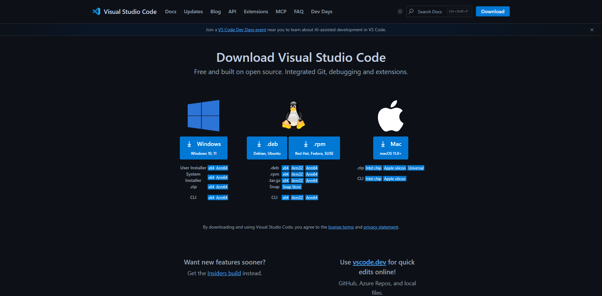
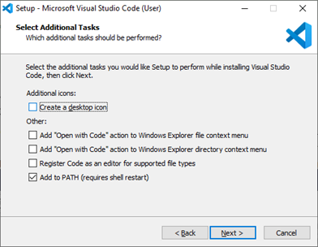

# Guía de Configuración de Entornos de Desarrollo

> 📋 **Guía Técnica**: Esta documentación establece los procedimientos para configurar un entorno de desarrollo en C# y otros lenguajes. Incluye las configuraciones necesarias para mantener consistencia en el desarrollo de software.

> **Nota importante**: Este documento se enfoca en aspectos técnicos y procedimientos. Para análisis comparativos, reflexiones personales y conclusiones, utiliza el archivo `CONCLUSIONES_EVALUACION.md`.

**Autores**: Anne y Sebastian
**Fecha V0**: [Fecha de entrega inicial]
**Fecha V1**: [Fecha de entrega final]

---

## Visual Studio Code - Entorno Principal

### Instalación y Verificación

**Método de instalación:** Instalador oficial (recomendado por se más simple y rápido)

> **💡 Sobre las imágenes**: INSTALACIÓN DE VISUAL STUDIO CODE







**Proceso de instalación:**
- **Descarga:**
  ## INSTALACIÓN DE VISUAL STUDIO CODE
1. Ir a la página de Microsoft Visual Studio Code y hacer clic en el botón" Descargar Visual Studio Code" 
2. Abrir el archivo .exe ubicado en la carpeta de descargar para la instalación 
3. Leer y aceptar el acuerdo de licencia y hacer clic en siguiente para continuar 
4. Seleccionar la ubicación de la carpeta de instalación o mantener la configuración predeterminada y dar clic a next para continuar 
5. Declarar el nombre de la carpetas de accesos directos en el menú de inicio
6. Selecionar las tareas adicionales como crear un icono el en escritorio,etc.
7. Por ultimo hacer clic en el botón de instalar.
8. El programa esta instalado y listo para usar y le damos a finalizar instalación y abrir el programa.
- **Opciones del instalador:** [Documentar las opciones que se consideraron importantes]
- **Verificación:** Uno de los metodos es abrir la terminal y usar el comando code, esto generaría que se abra el vs code.
- Otro metodo es escribir print("Hola Mundo") en vscode si el texto se colorea automaticamente significa que la sintaxis funciona.
- Al abrir la terminal desde ver escribimos el comando echo Hola VSCode nos respondera con HolaVSCode.


### Uso Básico de VS Code

**Navegación y funcionalidades básicas:**
- Navegación por la interfaz:
  Su uso básico es para abrir archivos, moverse entre los archivos abiertos o los comando de la paleta, tambien incluye los atajos del teclado, ademas de que existen funciones visuales como la barra de actividad, que nos permite acceder a secciones como el explorador de archivos o el control de las versiones, sumado a la posibilidad de dividir la pantalla para ver varios archivos a la vez.
- Edición de código:
  Sus funciones son el autocompletado inteligente,resaltado de sintaxis,resfactorización de código y el control de las versiones a traves de la integración de Git.
  
- Uso de la paleta de comandos: 
  Se usa para ejecutar la mayoria de funciones de editor y las extensiones instaladas, formatear codigo, abrir la terminal, etc.Para abirla puedes presionar: Ctrl+Shift+P en Windows/Linux. Algunos comandos a utilizar son:

  -Open File(Abre un archivo)

  -Save(Guarda el archivo actual)

  -Git: Clone(Clona un repositorio de Git si está instalada)

  -Configure display language(abre la configuracion de idioma)
 
- Gestión de archivos y carpetas: 
  Se centra en el panel de explorador, que muestra la estructura de una carpeta abierta o de varias, su uso es destinado a la creacion, apertura, guardado de archivos, gestión de las carpetas para organizar proyecto,ademas de contar con herramientas de navegacion rapida,etc.
  Atajos en el teclado:
  -Ctrl+N: Crea un archivo nuevo
  -Ctrl+S: Guarda el archivo actual
  -Ctrl+F4: Cierra la pestaña del archivo actual

### Personalización del Entorno

**Configuraciones aplicadas:** [Describir las personalizaciones que se realizaron]

*Ejemplos de configuraciones útiles (elegir las que se consideren relevantes):*

**Temas e iconos:**
Ejemplos:
- Material Theme, One Dark Pro
- File Icon Theme para mejor identificación de archivos

**Configuración de fuentes:**
Ejemplos:
- Fira Code, JetBrains Mono (con ligaduras)

**Atajos de teclado útiles:**
Ejemplos:
- Ctrl+/ para comentar/descomentar
- Ctrl+Shift+P para paleta de comandos
- Ctrl+` para terminal integrada
- Alt+↑/↓ para mover líneas

**Configuración del editor:**
Ejemplos:
- Formateo automático al guardar
- Detección automática de indentación
- Word wrap para líneas largas

**Terminal integrada:**
Ejemplos:
- PowerShell como terminal predeterminado
- Configuración de perfil personalizado

> **Personaliza según tus necesidades**: Estas son sugerencias basadas en prácticas comunes. Experimenta y documenta las configuraciones que encuentres más útiles para tu flujo de trabajo.> 💼 **Manual de Incorporación**: Esta guía establece los estándares del equipo para configurar entornos de desarrollo en C#. Cualquier nuevo desarrollador debe poder seguir estas instrucciones para configurar su entorno de trabajo de manera consistente con el resto del equipo.

### SDK .NET

**Proceso de instalación:**
1. **Descarga e instalación:** [Describir el proceso]
2. **Verificación:** [Cómo comprobar que funciona]

### Configuración para C#

**Extensiones esenciales:**
- **Soporte oficial para C#**: Extensión que proporciona IntelliSense, debugging y compilación


**Configuraciones específicas para C#:** 
[Describir las configuraciones que se aplicaron, como formateo automático, intellisense, o configuraciones del compilador]

**Debugging básico:**
- Configuración de puntos de interrupción (breakpoints)
- Ejecutar y depurar
- Inspección de variables

> **Enfoque práctico**: Concentra tu documentación en las funcionalidades básicas que usarás día a día.

### Flujo de Trabajo con C#

**Creación de proyectos:**
[Documentar el proceso para crear proyectos C#]

**Estructura de proyecto:**
```csharp
// Incluir aquí un ejemplo del código desarrollado
// Comentarios sobre las decisiones tomadas
```

**Compilación y ejecución:**
[Proceso para compilar y ejecutar proyectos]

**Debugging:**
[Configuración y uso de debugging]

---

## Visual Studio - IDE Alternativo

### Instalación

**Proceso de instalación:**
- **Descarga:** [Versión recomendada - Community/Professional]
- **Componentes necesarios:** [Componentes específicos para C#]
- **Verificación:** [Cómo confirmar instalación correcta]

### Desarrollo con C#

**Creación de proyecto:**
[Describir el proceso para crear un proyecto C# en Visual Studio]

**Flujo de trabajo básico:**
- Compilación y ejecución
- Uso de Solution Explorer
- Debugging básico

---

## Configuración de Lenguaje Adicional

**Lenguaje seleccionado:** [Java/Python/Otro] - **Justificación:** [Por qué se eligió este lenguaje]

### Instalación del Entorno

**Runtime/SDK:**
- **Descarga e instalación:** [Proceso paso a paso]
- **Verificación:** [Cómo confirmar que funciona]

### Configuración en VS Code

**Extensiones por lenguaje:**

*Para Java:*
- **Paquete completo de Java**: Incluye compilación, debugging y gestión de proyectos

*Para Python:*
- **Soporte oficial de Python**: Extensión completa con intérprete y debugging

*Para otros lenguajes:*
- Busca la extensión oficial del lenguaje que proporcione soporte completo

**Configuraciones específicas aplicadas:**
[Documentar los ajustes que se realizaron, como configuración del intérprete, formateo automático, linting, etc.]

### Proyecto de Ejemplo

**Código desarrollado:**
```[lenguaje]
// Código de ejemplo aquí
// Comentarios explicativos
```

**Proceso de ejecución:**
[Describir cómo ejecutar el código]

---

## Configuraciones Recomendadas

**Configuraciones generales:**
[Documentar configuraciones que se consideran útiles para cualquier desarrollador]

**Herramientas adicionales:**
[Extensions, herramientas CLI, o utilidades que se consideran beneficiosas]

**Solución de problemas comunes:**
[Problemas frecuentes durante la configuración y sus soluciones]

**Recursos útiles:**
- Enlace [Enlace]: [Descripción]
- Documentación [Documentación]: [Descripción]

---
